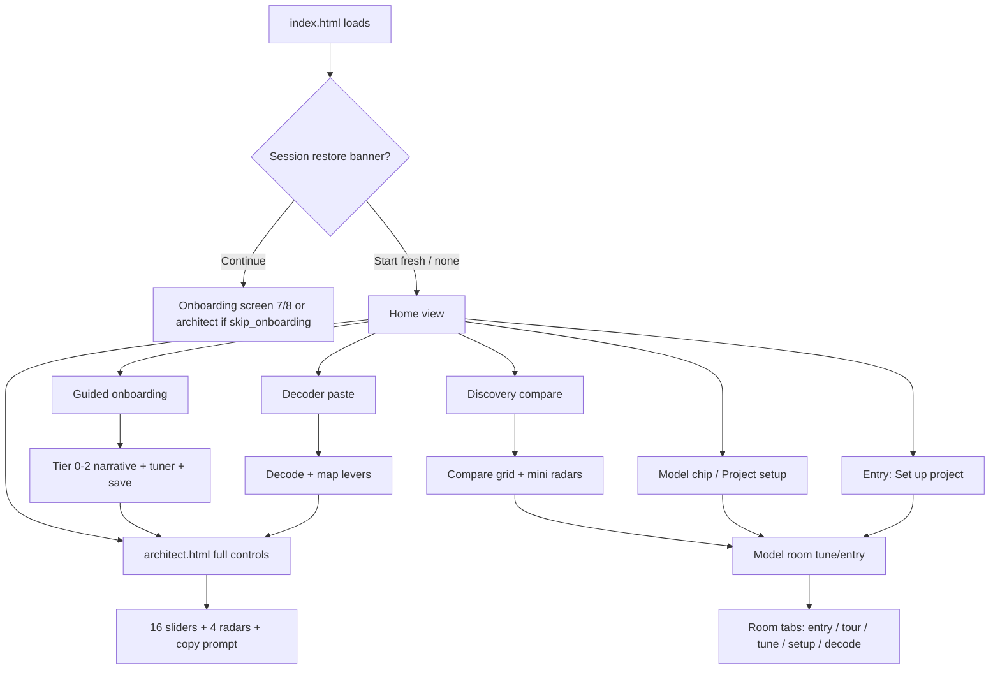

# AI Tuner v5.0 — Current State Audit

**Date:** May 21, 2026  
**Scope:** `AI-Tuner-v5.0/` (located at `/Users/johnviolette/AI-Tuner-v3.5/AI-Tuner-v5.0/`)  
**Purpose:** Baseline for design collaboration and new development. Describes what exists today from filesystem inventory and code inspection—not a roadmap.

---

## Executive summary

AI Tuner v5.0 is a **static, client-only web app** (no build step, no npm runtime dependencies). The live product is served from **`index.html`**, which loads ~20 JavaScript modules and **`css/visual-language.css`**, plus a large **inline `<style>` block** in `index.html` itself.

Two HTML entry points exist:

| Entry | Role |
|-------|------|
| **`index.html`** | Main SPA: home, guided onboarding, discovery, decoder, per-model “rooms,” profile |
| **`architect.html`** | Full-control page: all 16 lever sliders + four pillar radars + prompt copy/save |

Persistence is **`localStorage`** (`aituner_user`, `aituner_profile`, `aituner_session`, theme, flags). The only external runtime dependency is **Chart.js 4.4.1**, loaded on demand from jsDelivr when radars mount.

The repo also contains **~242 archived files** (v2/v3/v3.5 web copies, full iOS Xcode project, screenshots) and extensive markdown specs—these do not run as part of the v5 app unless opened manually.

---

## 1. File inventory

Line counts are `wc -l` on disk. `.git/` and `.DS_Store` omitted from role descriptions.

### 1.1 Active application (runtime + tooling) — 112 files

These are everything outside `archive/` and the 129k-line OG Cursor chat export.

#### Root HTML & config

| Lines | Path | What it does |
|------:|------|----------------|
| 1744 | `index.html` | **Primary app shell:** inline layout CSS (~1098 lines), view containers (home / onboarding / discovery / decoder / model-room), inlined `Router` + theme sync + history/hash routing, script load order, bootstrap (`AITunerV5`, profile, session restore, entry-card handlers) |
| 324 | `architect.html` | **Full controls page:** inline page CSS, all-lever sliders, four radars (tier 2), prompt display, profile panel, Act 5 graduation overlay; links back to `index.html` |
| 22 | `package.json` | npm metadata only; scripts for calibration CLI (`interview`, `observe`, `calibrate`, `apply-calibration`, `sync-registry`); **no dependencies** |
| 189 | `setup-v5.0.sh` | One-time git/folder setup from v3.5 parent repo |
| 52 | `.gitignore` | Ignores calibration outputs, proposed models, etc. |

#### Styles

| Lines | Path | What it does |
|------:|------|----------------|
| 1450 | `css/visual-language.css` | Shared design system: CSS variables (`:root`, `body.aituner-dark` / `aituner-light`), cards, buttons, entry cards, onboarding, model room, discovery, decoder, profile dialog, toasts; documents B&W contrast-first intent |

#### `src/` — application logic (34 JS files)

| Lines | Path | What it does |
|------:|------|----------------|
| 609 | `src/core/v5-engine.js` | **`AITunerV5`:** user/profile/session, 16 levers, model/persona/intent, prompt generation, configs, `localStorage`, tier flags |
| 540 | `src/core/prompt-synthesis-v9.js` | Builds system-prompt text from lever state + model + persona |
| 790 | `src/core/radar.js` | Four pillar Chart.js radars; tier 1 locks THINKING/OUTPUT; drag syncs sliders; loads Chart.js from CDN |
| 112 | `src/core/slider-controls.js` | Renders lever sliders by tier |
| 110 | `src/core/prompt-display.js` | Prompt panel + copy hookup |
| 166 | `src/core/prompt-preview-ui.js` | HTML preview fragments for prompts |
| 100 | `src/core/persona-selector.js` | Persona picker UI |
| 371 | `src/data/v5-levers.js` | 16 levers, `PILLAR_CONFIG`, `TIER1_LEVERS`; `window` + CommonJS export |
| 240 | `src/data/v5-models.js` | 8 models + default lever maps → `window.MODELS_V5` |
| 249 | `src/data/v5-personas.js` | Personas (incl. Truth-Seeker, Direct, Collaborator, Strategist) → `window.PERSONAS_V5` |
| 347 | `src/data/v5-model-rooms.js` | Model room copy/tour/setup metadata; registry init from JSON |
| 18 | `src/data/v5-models.proposed.js` | **Empty** shell for calibration pipeline output |
| 257 | `src/data/registry/model-rooms.json` | Room content registry (synced from JS via script) |
| 85 | `src/data/registry/registry-schema.json` | JSON schema for room registry |
| 7 | `src/data/registry/registry-version.json` | Registry version stamp |
| 261 | `src/decoder/lever-mapper.js` | Pattern → lever mapping for pasted prompts |
| 122 | `src/decoder/prompt-decoder.js` | `PromptDecoder` orchestration |
| 273 | `src/decoder/decoder-ui.js` | Decoder view mount, results, radar, CTA to architect |
| 373 | `src/discovery/discovery-ui.js` | `DiscoveryMode` + UI: questions, ≤4 models, compare grid, mini radars, open model room |
| 187 | `src/onboarding/onboarding-state.js` | Tier 0–2, skip-to-full, badge labels |
| 704 | `src/onboarding/onboarding-ui.js` | Narrative screens 0–8, frustration cards, tuner tier 0/1, radars, save config |
| 63 | `src/onboarding/model-samples.js` | Static sample answers per model/question |
| 143 | `src/profile/user-profile.js` | Literacy counters (`prompts_built`, `discovery_runs`, etc.) |
| 130 | `src/profile/session-restore.js` | “Continue / Start fresh” banner logic |
| 166 | `src/profile/profile-panel.js` | Profile modal, saved configs, navigation hooks |
| 769 | `src/rooms/room-ui.js` | **Model room:** entry / tour / tune / setup tabs; `window.openModelRoom` |
| 371 | `src/rooms/setup-ui.js` | Multi-step project setup wizard inside room |
| 183 | `src/setup/instructions-formatter.js` | Platform-specific instruction export formatting |
| 15 | `src/setup/knowledge-template.js` | Knowledge-upload copy templates |
| 94 | `src/setup/memory-guide.js` | Memory-setup guidance text |
| 174 | `src/ui/save-config-dialog.js` | Save-configuration overlay |

#### `calibration/` & `scripts/`

| Lines | Path | What it does |
|------:|------|----------------|
| 237 | `calibration/calibration-tool.js` | Node CLI stub for calibration runs |
| 117 | `calibration/interview-tool.js` | Prints elicitation sections; writes empty JSON templates per model |
| 56 | `calibration/observe-tool.js` | Node observe stub |
| 155 | `calibration/elicitation-prompts-v5.md` | Human-readable elicitation prompts |
| 7 | `calibration/elicitation-prompts.md` | Short pointer doc |
| 54 | `calibration/calibration-config.json` | Calibration config placeholder |
| 173 | `calibration/last-run-template.json` | Template for last-run output |
| 22×9 | `calibration/elicitation-responses/*-template.json` | Empty per-model response templates |
| 46 | `scripts/apply-calibration.js` | Merge proposed model defaults into `v5-models.js` |
| 46 | `scripts/export-model-rooms-json.js` | Export room registry JSON |

#### Duplicate / legacy at repo root (not loaded by `index.html`)

| Lines | Path | What it does |
|------:|------|----------------|
| 371 | `AITuner-v5-levers.js` | **Duplicate** of `src/data/v5-levers.js` (spec/handoff bundle; browser apps load `src/data/v5-levers.js`) |

#### `docs/` (implementation verification + reference)

| Lines | Path | What it does |
|------:|------|----------------|
| 238 | `docs/2026-0324-AITuner-Codebase-Audit.md` | **Prior audit (March 24)** — partially outdated after Stops 1–7 |
| 92–167 | `docs/2026-0324-AITuner-v5-Stop*-Verification.md` | Per-stop QA checklists (radar, discovery, rooms, theme, etc.) |
| 88 | `docs/2026-0327-AITuner-v5-PostStop7-Implementation-Verification.md` | Post–Stop 7 theme/copy notes |
| 107 | `docs/CONTEXT-BRIDGE.md` | v3.5 ↔ v5 mapping |
| 37 | `docs/visual-language-guide.md` | Short design principles (companion to CSS) |
| 454+ | `docs/reference/**` | v3.5 engine copies, Claude insight notes |

---

### 1.2 Product documentation & design artifacts (root + folders)

| Lines | Path | What it does |
|------:|------|----------------|
| 67 | `README.md` | Quick start pointer to FINAL spec |
| 120 | `SETUP-COMPLETE.md` | Setup completion notes |
| 963 | `AITuner-v5-FINAL-Cursor-Spec.md` | Master implementation spec |
| 589 | `AITuner-v5-Domain-Model-Spec.md` | Domain model |
| 985 | `AITuner-v5-Onboarding-Narrative-Script.md` | Onboarding copy source |
| 424 | `2026-0327-AITuner-v5-Cursor-Update-PostStop7.md` | Cursor handoff after Stop 7 |
| 705+ | `2026-0428-ClaudeAITTUner51Files/*` | v5.1 design docs (setup guide, prompt redesign, domain model HTML) |
| 411 / 389 | `Claude Coach/*.html` | Static onboarding storyboards (not wired to app) |
| 270 / 191 | `AITuner-v5-Domain-Model2.html`, `AITuner_v5_domain_model.html` | Mermaid domain diagrams (esm.sh) |
| 266–451 | `2026-0315-*.md`, `2026-0327-*.md` | Elicitation, onboarding, personas, Truth-Seeker specs |
| 176 | `AdaptiveUI-Concept-ParkingLot.md` | Deferred UI ideas |
| 224 | `AITuner-Origin-Story.md` | Product narrative |

---

### 1.3 Archive (`archive/`) — 242 files, not part of v5 runtime

| Folder | Files | Contents |
|--------|------:|----------|
| `archive/v2.0/` | 48 | Legacy v2 web (index, script.js, style.css, v6-engine, docs) |
| `archive/v3.0/` | 48 | Legacy v3 web (same structure as v2) |
| `archive/v3.5-reference/v3.5/` | 10 | Frozen v3.5 HTML/JS/CSS/radar reference |
| `archive/AI-Tuner-iOS/` | 136 | Full **AITuner4** Xcode project, Fastlane, screenshots, provisioning docs |

Serving v5 for development: static HTTP server on `AI-Tuner-v5.0/` (e.g. `python3 -m http.server 8765`) → open `/index.html`.

---

### 1.4 Non-runtime bulk (excluded from “app” counts)

| Path | Note |
|------|------|
| `AI Tuner Origin - OG Cursor Chats/cursor_analyzing_ai_response_filter_sys.md` | ~130k lines — historical Cursor log, not code |
| `2026-0428-ClaudeAITTUner51Files.zip` | Archived zip |
| `.git/` | Repository metadata |

**Total tracked files (excluding `.git`):** ~330. **Active v5 product surface:** ~112 files, ~15k lines of HTML/JS/CSS excluding archive.

---

## 2. Current entry point and user flow

### 2.1 What opens first

When you serve the folder and open the site root (or `index.html` explicitly), the browser loads **`index.html`**.

Load sequence:

1. Parse HTML → apply **inline `<style>`** (layout/view-specific rules).
2. Link **`css/visual-language.css`** (tokens, components, dark/light).
3. Load scripts in dependency order (data → synthesis → engine → radar → features → inline bootstrap).
4. Inline IIFE: theme from `localStorage` / default dark → `new AITunerV5()` → profile/session → wrap `engine.copyPrompt` for analytics → `new Router()` → register views → seed **History API** + hash (`#/aituner/v/...`, `#/aituner/room/:modelId/:tab`).

Default visible view: **`#home-view`** unless hash or restored session routes elsewhere.

### 2.2 User flow diagram



### 2.3 Entry paths (from home)

| User action | Code path | Destination |
|-------------|-----------|-------------|
| “New to this? Start here.” | `data-entry="guided"` → `router.navigateTo('onboarding')` | Onboarding screens 0→… |
| “I want to explore the models” | `discovery` | `#discovery-view` → `DiscoveryUI.mount` |
| “I found a prompt…” | `decoder` | `#decoder-view` → `DecoderUI.mount` |
| “I know what I'm doing” | `skipToFullControls()` + `architect.html` | Full architect page |
| “Set up a project” | Expands model chips → `openModelRoom({ initialTab: 'setup' })` | Model room setup wizard |
| “I already use…” chips | `openModelRoom({ initialTab: 'entry' })` | Model room |
| Session **Continue** | `routeSessionContinue()` | Onboarding 7/8 or `architect.html` if `skip_onboarding` |
| Hash `#/aituner/v/discovery` etc. | `parseRouteFromLocation()` on load / popstate | Matching view |
| Hash `#/aituner/room/claude/tune` | Sets `_pendingRoomOpts` → `model-room` view | `ModelRoomUI.open` |

### 2.4 Second entry: `architect.html`

Loaded when user chooses full controls or finishes certain flows (`decoder-ui` CTA, onboarding graduation, session continue with `skip_onboarding`). Initializes its own `AITunerV5` instance, renders **all** levers at tier 2, mounts radars, does **not** include discovery/onboarding/model-room views on the same page.

---

## 3. What's actually working (code inspection)

Legend: **Wired** = end-to-end in UI; **Partial** = works with gaps; **Stub** = shell only; **Dead** = present but unused.

### 3.1 Core platform

| Feature | Status | Notes |
|---------|--------|-------|
| 16-lever domain + pillars | **Wired** | `v5-levers.js`, engine, sliders |
| 8 models + defaults | **Wired** | `v5-models.js` |
| Personas + partial overrides | **Wired** | Engine snapshot/restore; room + onboarding |
| Prompt synthesis + live regenerate | **Wired** | `prompt-synthesis-v9.js` on lever change |
| localStorage user/profile/session | **Wired** | Keys: `aituner_user`, `aituner_profile`, `aituner_session` |
| Save/load named configs | **Wired** | Engine + `save-config-dialog.js` + profile panel |
| Copy prompt + `prompts_built` counter | **Wired** | Wrapped on both `index.html` and `architect.html` |
| Theme dark/light | **Wired** | `aituner-theme` + `body.aituner-dark/light` |
| Hash + browser history | **Wired** | Inlined `Router` in `index.html` |

### 3.2 Surfaces

| Feature | Status | Notes |
|---------|--------|-------|
| Home + 5 entry cards | **Wired** | Includes project-setup picker |
| Guided onboarding (screens 0–8) | **Wired** | Narrative, frustration cards, model pick, tier 0/1 tuner |
| Tier 1 radars (Character/Voice active) | **Wired** | `mountAITunerV5Radars` tier 1 |
| Tier 2 unlock (all pillars + drag) | **Wired** | Tier unlock toasts in `onboarding-ui.js` |
| Discovery: questions + model pick | **Wired** | Max 4 models |
| Discovery: compare grid | **Wired** | Static samples from `model-samples.js`, mini radars, tune/notice CTAs — **not** live LLM calls |
| Decoder: paste + decode | **Wired** | Pattern mapper + breakdown UI + decoder radar |
| Decoder: unmapped lines | **Partial** | Heuristic mapper; lines that don't match patterns listed, not NLP extraction |
| Model room (entry/tour/tune/setup) | **Wired** | `room-ui.js` + registry |
| Project setup wizard | **Wired** | `setup-ui.js`, instruction formatter, memory guide |
| Profile panel | **Wired** | Stats, saved configs, open room/discovery |
| Session restore banner | **Wired** | Routes to onboarding or architect |
| Architect full controls | **Wired** | Separate page, all levers |
| Act 5 graduation overlay | **Wired** | `architect.html` once per user |

### 3.3 Tooling / pipeline

| Feature | Status | Notes |
|---------|--------|-------|
| Calibration CLI | **Stub** | Node scripts print/write templates; no automated scoring loop in repo |
| `v5-models.proposed.js` | **Stub** | Empty object; filled only after manual calibration workflow |
| `apply-calibration` script | **Partial** | Exists; requires human promotion |
| Registry JSON export | **Wired** | `npm run sync-registry` |

### 3.4 Removed or consolidated (vs March audit)

These were listed as missing in `docs/2026-0324-AITuner-Codebase-Audit.md` but are **now implemented or merged**:

- `decoder-ui.js`, `discovery-ui.js` (replaces separate `discovery-mode.js`)
- Model rooms (`room-ui.js`, `v5-model-rooms.js`)
- Router **inlined** in `index.html` (`src/core/router.js` deleted)
- `tier-unlock.js` merged into `onboarding-ui.js`
- `registry-loader.js` logic in `v5-model-rooms.js`

---

## 4. Known issues, inconsistencies, and TODOs

### 4.1 From code comments and verification docs

| Issue | Source | Severity |
|-------|--------|----------|
| **Global tier badge** may not refresh when tier changes mid-onboarding | `docs/2026-0324-AITuner-v5-Stop2-Verification.md` | UX |
| **“Return to guided mode from settings”** — copy exists in narrative script, **no settings UI** | Stop 4 verification | Missing feature |
| **CSS not fully tokenized:** `index.html` inline rules + hardcoded hex (discovery frustration cards, session banner gradient, indigo notice chips) vs B&W visual-language intent | PostStop7 verification | Design debt |
| **`AITuner-v5-levers.js` duplicate** at repo root vs `src/data/v5-levers.js` | Drift risk if one is edited | Maintenance |
| **`index.html` is 1744 lines** (~63% inline CSS) — competes with `visual-language.css` | Structure | Maintainability |
| **Calibration pipeline** not production-complete | Stubs + empty proposed models | Data accuracy |
| **Discovery compare** uses **canned** `MODEL_SAMPLES`, not API responses | By design for static app | Product limitation |
| **OG chat export** in repo root — noise for collaborators | Accidental inclusion | Repo hygiene |

### 4.2 Behavioral edge cases

- Clearing `aituner_user` in another tab triggers **full page reload** (`storage` listener).
- `architect.html` profile callbacks use **`window.location.href = 'index.html'`** (full navigation), not in-SPA router.
- Decoder “Tune in Architect” uses **hard navigation** to `architect.html`.
- `openModelRoom` requires `window.modelRoomUI` initialized on `index.html` only.

### 4.3 Explicit TODO/FIXME in `src/`

No `TODO` / `FIXME` markers in active `src/**/*.js` at audit time. Limitations are documented in verification markdown rather than inline.

---

## 5. Dependencies

### 5.1 npm (`package.json`)

```json
"dependencies": {},
"devDependencies": {}
```

Runtime does **not** use npm packages in the browser.

### 5.2 External libraries (browser)

| Library | Version | Loaded from | Used by |
|---------|---------|-------------|---------|
| **Chart.js** | 4.4.1 | `https://cdn.jsdelivr.net/npm/chart.js@4.4.1/dist/chart.umd.min.js` | `src/core/radar.js` (dynamic `<script>` injection) |

### 5.3 External libraries (design-only HTML)

| Library | Loaded from | Files |
|---------|-------------|-------|
| **Mermaid** (ESM) | `https://esm.sh/mermaid@11/...` | `AITuner-v5-Domain-Model2.html`, `AITuner_v5_domain_model.html`, `2026-0428-.../AITuner-v51-Domain-Model.html` |

### 5.4 Archive-only CDN usage (not v5 app)

v2/v3 archived `index.html` files load **Lucide** and Chart.js from unpkg/jsDelivr — **not** used by v5 `index.html` or `architect.html`.

### 5.5 Fonts

System stack only: `-apple-system, BlinkMacSystemFont, 'Segoe UI', Roboto, …` (in CSS). No Google Fonts CDN in active v5 pages.

---

## 6. CSS architecture

### 6.1 Where styling lives

| Layer | Location | Role |
|-------|----------|------|
| **Design system** | `css/visual-language.css` (1450 lines) | Tokens (`--bg`, `--text`, `--border`, …), dark/light, components shared across views |
| **Page-specific layout** | `index.html` `<style>` (~lines 7–1098) | Discovery grid, decoder layout, model room, onboarding layout, session banner, many view rules **not** in visual-language |
| **Architect page** | `architect.html` `<style>` (~130 lines) | Architect grid + panel layout |
| **Storyboards** | `Claude Coach/*.html` | Self-contained demo CSS — **not** linked to app |

### 6.2 Is `visual-language.css` the single source of truth?

**No.** It is the **primary** shared stylesheet and the right place for new global rules, but:

1. **`index.html` carries a large parallel stylesheet** for view layout and feature-specific selectors (`.discovery-compare-*`, `.room-setup-*`, `.frustration-card`, etc.).
2. **Overlap exists** — e.g. `.discovery-placeholder` appears in both `index.html` and `visual-language.css`.
3. **Hardcoded colors remain** in inline CSS and some components (indigo/purple discovery chips, purple session-restore banner) documented as **not** matching the contrast-first B&W spec in PostStop7 verification.
4. **`architect.html`** links `visual-language.css` but relies on its own inline rules for architect layout.

**Practical rule for new work:** extend `visual-language.css` for tokens and reusable components; migrate duplicated blocks out of `index.html` when touching an area—avoid adding a third parallel CSS file.

### 6.3 Theming

- `body.aituner-dark` / `body.aituner-light` on both main pages.
- Persisted: `localStorage['aituner-theme']`.
- `prefers-color-scheme` handling described in Stop 7 docs (sync on load).

---

## 7. Files that reference `index.html` by name

### 7.1 Runtime code (loads or navigates to `index.html`)

| File | How |
|------|-----|
| `architect.html` | `window.location.href = 'index.html'` (profile saved-config callback); `index.html#/aituner/v/discovery` (discovery nav) |

No file under `src/` contains the string `index.html`. Navigation from JS uses `architect.html` or `router.navigateTo`, not string paths to index.

### 7.2 Documentation and specs (mentions `index.html`)

| File |
|------|
| `docs/2026-0324-AITuner-Codebase-Audit.md` |
| `docs/2026-0324-AITuner-v5-Stop1-Radar-Verification.md` |
| `docs/2026-0324-AITuner-v5-Stop2-Verification.md` |
| `docs/2026-0324-AITuner-v5-Stop3-Verification.md` |
| `docs/2026-0324-AITuner-v5-Stop4-Verification.md` |
| `docs/2026-0324-AITuner-v5-Stop5-Verification.md` |
| `docs/2026-0324-AITuner-v5-Stop6-Verification.md` |
| `docs/2026-0324-AITuner-v5-Stop7-Verification.md` |
| `docs/2026-0327-AITuner-v5-PostStop7-Implementation-Verification.md` |
| `docs/reference/2026-0315-AITuner-Current-Structure.md` |
| `2026-0327-AITuner-v5-Cursor-Update-PostStop7.md` |
| `2026-0428-ClaudeAITTUner51Files/AITuner-ProjectSetupGuide-DesignDoc.md` |
| `2026-0428-ClaudeAITTUner51Files/AITuner-v5-Cursor-Update-PostStop7.md` |
| `AITuner-v5-FINAL-Cursor-Spec.md` |
| `2026-0315-AITuner-Onboarding-Cursor-Prompt.md` |
| `css/visual-language.css` | Comment only: “index.html still sets slate hex…” |

### 7.3 Archive / historical (not v5 runtime)

| File |
|------|
| `archive/v2.0/_quarantine/archive/landing.html` |
| `archive/v3.0/_quarantine/archive/landing.html` |
| `archive/v2.0/_quarantine/tests/run-tests.sh` |
| `archive/v3.0/_quarantine/tests/run-tests.sh` |
| `archive/v3.0/V3.0-COMPLETE.md`, `DEPLOYMENT.md`, `SINGLE-CODEBASE-SUMMARY.md`, `docs/*.md` |

### 7.4 Historical chat log (many duplicate mentions)

| File |
|------|
| `AI Tuner Origin - OG Cursor Chats/cursor_analyzing_ai_response_filter_sys.md` |
| `AI Tuner Origin - OG Cursor Chats/cursor_absolute_mode_overlay_discussion.md` |

### 7.5 Storyboard (annotation only)

| File |
|------|
| `Claude Coach/AITuner_v5_onboarding_storyboard.html` | Notes expert path skips to `architect.html`, not `index.html` load order |

---

## 8. Recommended baseline for new development

1. **Treat `index.html` + `src/` + `css/visual-language.css` as the product**; ignore `archive/` unless porting legacy behavior.
2. **Design collaboration** should start from `visual-language-guide.md` + `visual-language.css`, with awareness that **home/discovery/room layouts still live in `index.html` inline CSS**.
3. **Do not edit `AITuner-v5-levers.js` at root** without syncing `src/data/v5-levers.js` (or delete the duplicate).
4. **Prior design-debt bundle** if aligning UI: tokenize remaining hex in `index.html`, unify discovery/session accents to B&W system, split inline CSS into a dedicated `css/views.css` when ready.
5. **Feature gaps** to confirm with product before build: settings screen, live model comparison API, full calibration automation.

---

## 9. Quick reference — script load order on `index.html`

```
v5-levers → v5-models → v5-personas → v5-model-rooms
→ prompt-synthesis-v9 → prompt-preview-ui → v5-engine → radar → slider-controls
→ prompt-display → persona-selector
→ lever-mapper → prompt-decoder → decoder-ui → discovery-ui
→ user-profile → session-restore → profile-panel
→ onboarding-state → model-samples → onboarding-ui
→ save-config-dialog → knowledge-template → instructions-formatter → memory-guide
→ setup-ui → room-ui
→ [inline: Router, bootstrap, handlers]
```

**Count:** 22 external scripts + 1 large inline block.

---

*End of audit. For stop-by-stop implementation history, see `docs/2026-0324-AITuner-v5-Stop*-Verification.md` and `docs/2026-0327-AITuner-v5-PostStop7-Implementation-Verification.md`.*
