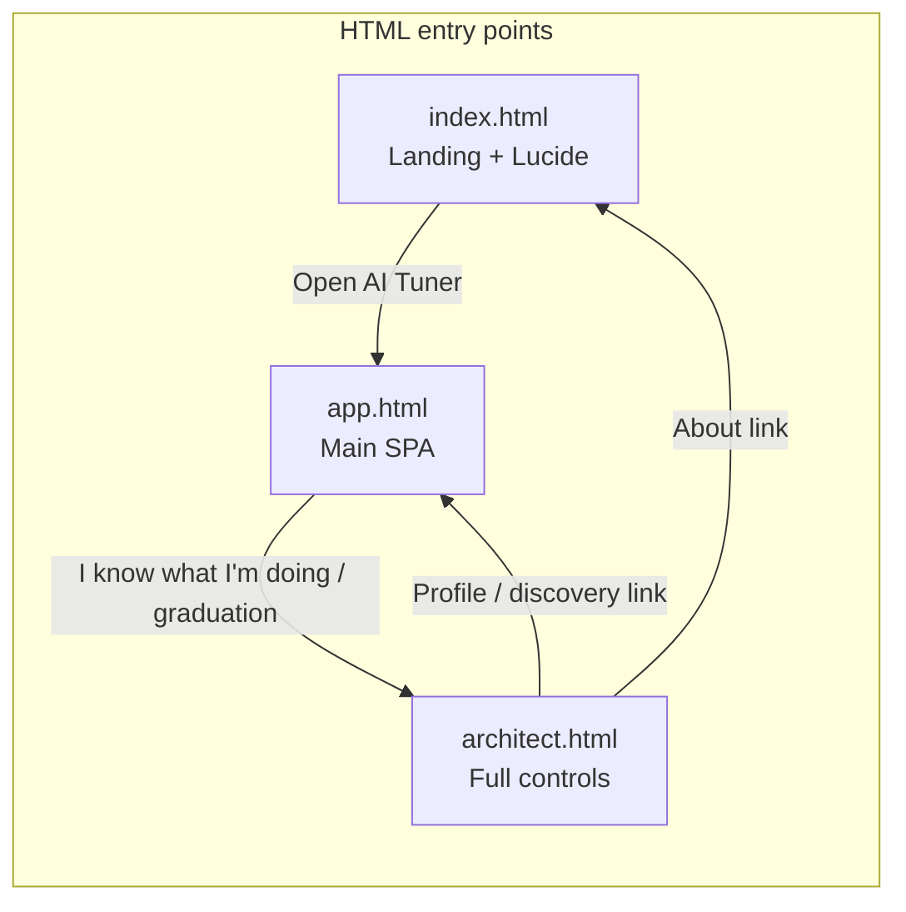
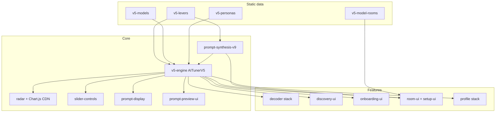
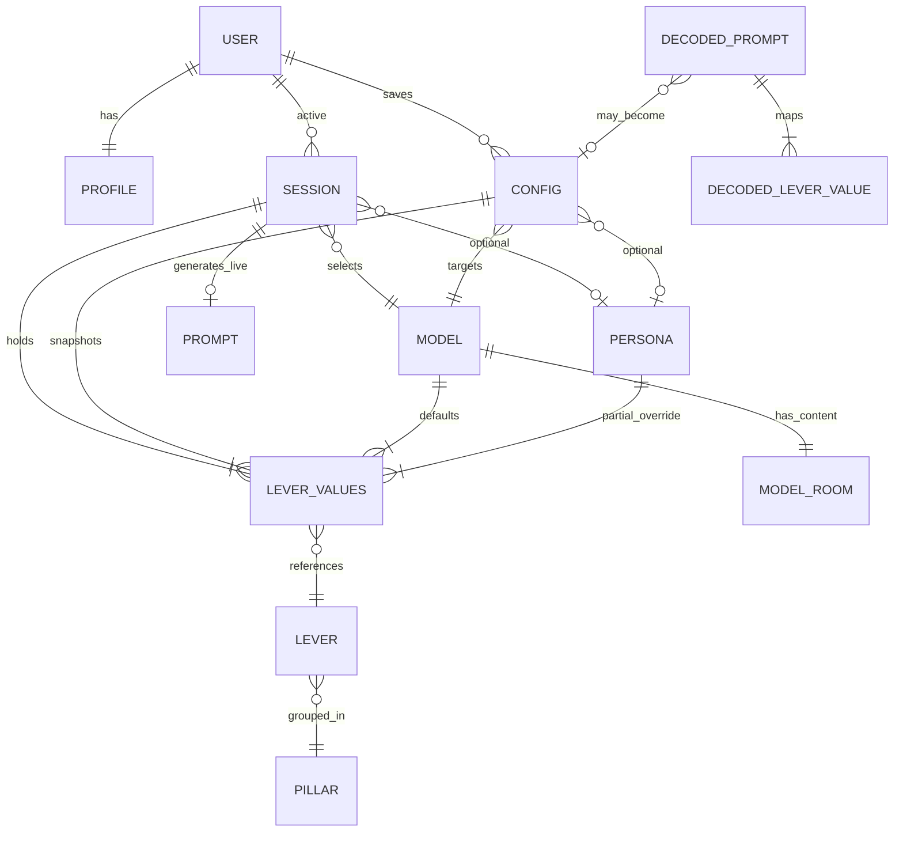

# AI Tuner v5.0 — Domain Model & Structure Map (As-Is)

**Date:** May 22, 2026  
**Scope:** `AI-Tuner-v5.0/` runtime product only (not `archive/`, not iOS)  
**Method:** Filesystem + code inspection of live entry points, `src/`, and `localStorage` contracts  

**Companion specs (design intent, may lag code):** `AITuner-v5-Domain-Model-Spec.md`, `AITuner-v5-FINAL-Cursor-Spec.md`  
**Prior inventory:** `docs/2026-0521-AITuner-v5-Current-State-Audit.md` (update: primary SPA is now `app.html`, not monolithic `index.html`)

---

## 1. What v5.0 is

| Property | Value |
|----------|--------|
| Architecture | Static client-only SPA — no bundler, no npm runtime in browser |
| Persistence | `localStorage` only (no auth, no API) |
| Core job | User picks **model** (+ optional **persona**), tunes **16 levers**, gets a **generated system prompt** to copy into any chatbot |
| Lever scale | 0–10 integers |
| Models | 8 fixed platforms |
| Personas | 7 presets in data (onboarding copy references more archetypes) |
| External runtime | **Chart.js 4.4.1** (CDN, loaded on demand by `radar.js`) |
| Landing CDN | **Lucide** icons on `index.html` only (`unpkg.com`) |

---

## 2. Entry points & surfaces



| File | Role | Scripts loaded |
|------|------|----------------|
| `index.html` | Marketing landing; links to `app.html` | `app-chrome.js`, Lucide CDN |
| `app.html` | **Product SPA:** home, onboarding, discovery, decoder, model rooms | 22 `src/**/*.js` + inlined `Router` + bootstrap (~520 lines inline) |
| `architect.html` | All 16 sliders + 4 pillar radars + prompt copy; no discovery/rooms on same page | Subset of `src/` (no decoder, discovery, rooms, setup) |

### 2.1 Views inside `app.html` (Router)

Inlined `class Router` in `app.html` registers:

| View key | DOM container | Mount / show |
|----------|---------------|--------------|
| `home` | `#home-view` | Default unless hash/session routes elsewhere |
| `onboarding` | `#onboarding-view` | `OnboardingUI.initialize` |
| `discovery` | `#discovery-view` | `DiscoveryUI.mount` |
| `decoder` | `#decoder-view` | `DecoderUI.mount` |
| `model-room` | `#model-room-view` | `ModelRoomUI.open` via `openModelRoom()` |

**URL contract (History API + hash):**

- `#/aituner/v/{home|onboarding|discovery|decoder|model-room}`
- `#/aituner/room/{modelId}/{tab}` → sets `window._pendingRoomOpts`, navigates to `model-room`

**Globals set at bootstrap:** `window.router`, `window.modelRoomUI`, `window.onboardingUI`, `window.discoveryUI`, `window.decoderUI`, `engine` (const, not on `window` — modules use closure or passed refs).

### 2.2 Model room tabs (`room-ui.js`)

| Tab | Purpose |
|-----|---------|
| `entry` | Room intro, self-description, strengths/weaknesses |
| `tour` | Guided tour copy |
| `tune` | Sliders + radars + persona + save |
| `setup` | `ProjectSetupUI` wizard (knowledge / instructions / memory) |
| (decoder CTA) | Can deep-link from decoder with lever state |

---

## 3. Domain model (entities as implemented)

The engine (`AITunerV5`) documents **15 entity types**. Below maps **spec name → where it lives in code**.

### 3.1 Entity glossary

| Entity | Implementation | Persisted? |
|--------|----------------|------------|
| **USER** | `engine.user` — `createUser()` | `localStorage['aituner_user']` |
| **PROFILE** | `engine.profile` + `UserProfile` literacy counters | `aituner_profile` |
| **SESSION** | `engine.session` — ephemeral work unit | `aituner_session` (7-day restore) |
| **CONFIG** | Saved preset in `aituner_configs[]` | `aituner_configs` |
| **LEVER_VALUES** | `engine.leverValues` map; copied into CONFIG on save | Session + CONFIG blob |
| **MODEL** | `MODELS_V5[id]` static data | JS file only |
| **LEVER** | `LEVERS_V5[key]` definitions | `v5-levers.js` |
| **PILLAR** | `PILLAR_CONFIG` (4 pillars × 4 levers) | `v5-levers.js` |
| **PERSONA** | `PERSONAS_V5[id]` | `v5-personas.js` |
| **PROMPT** | `engine.currentPrompt` — regenerated every lever change | Not persisted (live only) |
| **INTENT** | `engine.selectedIntent` / `session.intent` | Session + profile `default_intent` |
| **MODEL_ROOM** | `MODEL_ROOMS_V5` + optional `registry/model-rooms.json` | JS + JSON fetch |
| **DECODED_PROMPT** | `PromptDecoder` result + `aituner_decoded` | `aituner_decoded` |
| **DECODED_LEVER_VALUE** | Output of `mapPromptToLevers()` | In decoder UI state only |
| **CALIBRATION_RUN** | Node CLI stubs | Not wired to browser |

### 3.2 USER

```json
{
  "id": "uuid",
  "tier": 0,
  "has_copied": false,
  "has_tuned": false,
  "skip_onboarding": false
}
```

**Tier unlock rules (implemented):**

| Transition | Trigger |
|------------|---------|
| 0 → 1 | First `copyPrompt()` while `tier === 0` |
| 1 → 2 | First `adjustLever()` while `tier === 1` |
| Skip all | `skip_onboarding: true` or navigate to `architect.html` |

`OnboardingState` mirrors tier for UI (badge, which levers/radars show). `TierUnlock` toasts live in `onboarding-ui.js`.

### 3.3 PROFILE

```json
{
  "user_id": "uuid",
  "preferred_model": "claude | null",
  "default_intent": "string | null",
  "last_active": "ISO8601",
  "literacy": {
    "prompts_built": 0,
    "discovery_runs": 0,
    "decodes_run": 0,
    "rooms_opened": 0,
    "configs_saved": 0
  }
}
```

`UserProfile` increments literacy counters; wrapped `engine.copyPrompt` increments `prompts_built`.

### 3.4 SESSION

```json
{
  "id": "uuid",
  "user_id": "uuid",
  "model_id": "claude | null",
  "persona_id": "therapist | null",
  "intent": "string | null",
  "entry_point": "guided | discovery | decoder | full | manual",
  "created_at": "ISO8601",
  "lever_values": { "assertiveness": 5, "...": 7 }
}
```

**Rules in code:**

- `entry_point` set once per session (`setEntryPoint`) — not overwritten if already set.
- `persistSession()` every 30s + `beforeunload`.
- Restore if age &lt; 7 days; else new session.
- Clearing `aituner_user` in another tab → full page reload (`storage` listener).

### 3.5 CONFIG

```json
{
  "id": "uuid",
  "user_id": "uuid",
  "model_id": "claude",
  "name": "User label",
  "source": "guided | decoded | discovery | manual",
  "persona_id": "direct | null",
  "created_at": "ISO8601",
  "lever_values": { "...": 0-10 }
}
```

Stored as array in `aituner_configs`. **Does not store generated prompt text** — prompt is always recomputed on load.

### 3.6 PROMPT (runtime)

Produced by `PROMPT_SYNTHESIS_V9.compose(engine)`:

```json
{
  "id": "uuid",
  "config_id": null,
  "model_id": "claude",
  "generated_text": "...",
  "sourceMap": [],
  "neutralLevers": [],
  "hierarchy": "Output → Character → Voice → Thinking",
  "wordCount": 123,
  "created_at": "ISO8601"
}
```

Optional append: **emoji shutoff** block (`aiTunerEmojiShutoff` / `AITunerAppChrome`).

### 3.7 Lever precedence (critical business rule)

```
model.defaults  →  persona.lever_values (partial)  →  manual adjustLever()
```

- Persona apply: snapshot `prePersonaSnapshot` before overlay; `removePersona()` restores.
- `loadModelDefaults()` overwrites all keys present in model defaults when model selected.

### 3.8 Static catalog: 16 levers × 4 pillars

| Pillar | Levers |
|--------|--------|
| **CHARACTER** | `assertiveness`, `formality`, `playfulness`, `emotionalWarmth` |
| **VOICE** | `conciseness`, `teachingMode`, `initiative`, `questionFrequency` |
| **THINKING** | `transparency`, `creativity`, `confidence`, `citationHabit` |
| **OUTPUT** | `formatting`, `responseLength`, `safetyDisclaimers`, `toneMatching` |

**Tier 1 subset** (`TIER1_LEVERS`): `initiative`, `assertiveness`, `conciseness`, `formality`, `emotionalWarmth` — used in onboarding tuner before full unlock.

**Radar tier behavior** (`radar.js`):

| Tier | CHARACTER / VOICE | THINKING / OUTPUT |
|------|-------------------|------------------|
| 0–1 | Interactive drag → sliders | Locked (display only) |
| 2 | All pillars draggable | All pillars draggable |

### 3.9 MODELS (8)

`claude`, `chatgpt`, `gemini`, `grok`, `mistral`, `llama`, `perplexity`, `cursor`

Each: `id`, `name`, `provider`, `voice_signature`, `defaults` (16 keys).

Calibration path: `v5-models.proposed.js` (empty) → `npm run apply-calibration` → promotes into `v5-models.js` (manual pipeline).

### 3.10 PERSONAS (7 in `v5-personas.js`)

`therapist`, `direct`, `collaborator`, `strategist`, `coder`, `researcher`, `tutor`

Each: `id`, `name`, `description`, `activation_snippet`, `lever_values` (partial map).

### 3.11 MODEL_ROOM (content)

Dual source:

1. **Embedded:** `MODEL_ROOMS_V5` in `v5-model-rooms.js`
2. **Optional overlay:** `fetch('src/data/registry/model-rooms.json')` via `initModelRoomRegistry()`

API: `getModelRoom(id)`, `getAllModelRooms()`, fallback to embedded on fetch failure.

### 3.12 INTENT + discovery samples

**Intent** strings used in discovery/onboarding (e.g. career, writing, coding) — not a separate entity file; validated in UI.

**MODEL_SAMPLES** (`model-samples.js`): canned Q&A per intent × model — **not live LLM** responses.

---

## 4. Module dependency graph

### 4.1 Script load order (`app.html`)

Strict order — later files assume earlier globals:

```
Layer 0 — Data (window globals)
  v5-levers.js      → LEVERS_V5, PILLAR_CONFIG, TIER1_LEVERS
  v5-models.js      → MODELS_V5
  v5-personas.js    → PERSONAS_V5
  v5-model-rooms.js → MODEL_ROOMS_V5, getModelRoom, initModelRoomRegistry

Layer 1 — Prompt + engine
  prompt-synthesis-v9.js  → PROMPT_SYNTHESIS_V9  (requires LEVERS_V5)
  prompt-preview-ui.js    → PromptPreviewUi
  v5-engine.js            → AITunerV5             (requires all data + synthesis)
  radar.js                → mountAITunerV5Radars  (requires engine + pillars; loads Chart.js)
  slider-controls.js      → SliderControls
  prompt-display.js         → PromptDisplay
  persona-selector.js       → PersonaSelector

Layer 2 — Features
  lever-mapper.js           → LEVER_MAP, mapPromptToLevers
  prompt-decoder.js         → PromptDecoder
  decoder-ui.js             → DecoderUI
  discovery-ui.js           → DiscoveryMode, DiscoveryUI
  user-profile.js           → UserProfile
  session-restore.js        → SessionRestore
  profile-panel.js          → ProfilePanel

Layer 3 — Flows
  onboarding-state.js       → OnboardingState
  model-samples.js          → MODEL_SAMPLES
  onboarding-ui.js          → OnboardingUI, TierUnlock
  save-config-dialog.js     → openSaveConfigDialog
  knowledge-template.js     → ProjectSetupKnowledge (stub)
  instructions-formatter.js → ProjectSetupInstructionsFormatter
  memory-guide.js           → ProjectSetupMemoryGuide
  setup-ui.js               → ProjectSetupUI
  room-ui.js                → ModelRoomUI, openModelRoom, ROOM_MODE_PRESETS
  app-chrome.js             → AITunerAppChrome

Layer 4 — Bootstrap (inline in app.html)
  Router, engine init, view registration, history/hash, entry-card handlers
```

### 4.2 Runtime dependency diagram



### 4.3 `architect.html` subset

Loads: data + synthesis + engine + radar + sliders + prompt-display + persona-selector + profile + onboarding-state + profile-panel + save-config-dialog + app-chrome.

**Missing on architect page:** decoder, discovery, model rooms, setup wizard, `openModelRoom`, inlined Router (full-page only).

---

## 5. Cross-cutting globals (`window.*`)

| Global | Owner file | Consumers |
|--------|------------|-----------|
| `LEVERS_V5`, `PILLAR_CONFIG`, `TIER1_LEVERS` | v5-levers | engine, radar, sliders, synthesis, decoder |
| `MODELS_V5` | v5-models | engine, discovery, rooms, decoder |
| `PERSONAS_V5` | v5-personas | engine, persona-selector, rooms |
| `MODEL_ROOMS_V5`, `getModelRoom`, `initModelRoomRegistry` | v5-model-rooms | room-ui |
| `PROMPT_SYNTHESIS_V9` | prompt-synthesis-v9 | engine, instructions-formatter |
| `AITunerV5` | v5-engine | all surfaces |
| `mountAITunerV5Radars` | radar | onboarding, discovery, rooms, architect |
| `drawRadarV6` | radar | **deprecated** legacy hook |
| `router` | app.html inline | onboarding, rooms, discovery nav |
| `openModelRoom` | room-ui | home chips, discovery, profile — **app.html only** |
| `openSaveConfigDialog` | save-config-dialog | onboarding, rooms |
| `PromptPreviewUi` | prompt-preview-ui | onboarding, prompt-display |
| `AITunerAppChrome` | app-chrome | theme + emoji shutoff |
| `MODEL_SAMPLES` | model-samples | discovery, onboarding |

**Implicit coupling:** No module system — every file assumes load order and `window` pollution. Refactors must preserve script tag order or introduce a bundler.

---

## 6. Persistence map

| Key | Shape | Written by |
|-----|-------|------------|
| `aituner_user` | USER object | v5-engine |
| `aituner_profile` | PROFILE + literacy | v5-engine, UserProfile |
| `aituner_session` | SESSION + lever_values | v5-engine `persistSession` |
| `aituner_configs` | CONFIG[] | v5-engine `saveConfig` |
| `aituner_decoded` | last decode metadata | prompt-decoder |
| `aituner-theme` | `'dark' \| 'light'` | app-chrome |
| `aiTunerEmojiShutoff` | `'true' \| 'false'` | app-chrome, engine (duplicate writers) |
| `aituner_act5_graduation_seen` | `'1'` | architect.html only |

**Legacy keys not used by v5 runtime** (still in archive v2/v3): `aiTunerDarkMode`, `ai_tuner_presets_v6`, `ai_tuner_events`, etc.

---

## 7. Styling architecture (as-is)

| Layer | Location |
|-------|----------|
| Design system | `css/visual-language.css` (~1450 lines) — tokens, components, view layouts |
| Landing-only | `index.html` — minimal; uses `landing-page` classes |
| App / architect | No large inline `<style>` in current `app.html` (styles in visual-language) |
| Architect layout | Small inline grid rules in `architect.html` |

**Design debt:** Some verification docs note hardcoded accent colors vs B&W spec; grep `visual-language.css` and discovery/session components when tokenizing.

---

## 8. Tooling (Node, not browser)

| npm script | File | Purpose |
|------------|------|---------|
| `interview` | calibration/interview-tool.js | Print elicitation; write empty JSON templates |
| `observe` | calibration/observe-tool.js | Stub |
| `calibrate` | calibration/calibration-tool.js | Stub |
| `apply-calibration` | scripts/apply-calibration.js | Merge proposed → live models |
| `sync-registry` | scripts/export-model-rooms-json.js | Export room registry JSON |

---

## 9. Dependencies to fix (prioritized)

These are **structural risks** inferred from code — not a product roadmap.

### P0 — Correctness / drift

| Issue | Evidence | Fix direction |
|-------|----------|---------------|
| **Duplicate lever file** | `AITuner-v5-levers.js` at repo root mirrors `src/data/v5-levers.js` | Delete root copy or single-source export; only `src/data/` is loaded |
| **Dual theme/emoji writers** | `app-chrome.js` and `v5-engine.js` both touch `aiTunerEmojiShutoff`; theme in chrome + `aituner-theme` | Single module owns preference; engine reads via event or injected getter |
| **Registry vs embedded rooms** | JSON fetch can diverge from `MODEL_ROOMS_V5` without `sync-registry` discipline | CI check: `npm run sync-registry` diff clean; or one source only |
| **Empty calibration pipeline** | `v5-models.proposed.js` empty; CLI stubs | Complete pipeline or document manual-only workflow |

### P1 — Architecture / maintainability

| Issue | Evidence | Fix direction |
|-------|----------|---------------|
| **No module bundler** | 22 script tags + implicit `window` order | ES modules + Vite, or explicit `aituner-manifest.js` |
| **Router inlined in `app.html`** | ~300 lines history/hash in HTML | Extract `src/core/router.js` (deleted per Stop 7 — worth restoring) |
| **Split SPA vs architect** | Two pages, two engine instances, hard `location.href` | Single SPA route `#/aituner/v/architect` or shared shell |
| **`openModelRoom` only on app.html** | architect profile can't open rooms in-place | Pass deep links to `app.html#/aituner/room/...` consistently |
| **Deprecated `drawRadarV6`** | radar.js legacy shim | Remove after confirming no external bookmarks depend on it |

### P2 — Product / UX gaps (spec vs code)

| Issue | Evidence | Fix direction |
|-------|----------|---------------|
| **Settings / return to guided** | Narrative mentions; no settings UI | Add settings view or profile action |
| **Discovery is canned** | `MODEL_SAMPLES` static | Document as intentional or add optional API layer |
| **Decoder heuristic only** | `lever-mapper.js` patterns | Set expectations; optional LLM assist later |
| **Tier badge refresh** | Stop 2 verification note | Wire `onTierChange` to global badge in all views |
| **Lucide unpinned `@latest`** | `index.html` CDN | Pin version for reproducible landing |

### P3 — Repo hygiene

| Issue | Fix direction |
|-------|---------------|
| `archive/` + OG chat logs in tree | `.gitignore` or docs pointer only |
| Outdated audit saying `index.html` is 1744-line SPA | Point to this doc + `app.html` |

---

## 10. Entity relationship (ERD)



---

## 11. User journey → code map

| User intent | Entry | Primary modules |
|-------------|-------|-----------------|
| Learn product | `index.html` | static copy |
| First-time guided | Home → onboarding | `onboarding-ui`, `onboarding-state`, `TierUnlock`, radars tier 0→2 |
| Compare models | discovery | `discovery-ui`, `MODEL_SAMPLES`, mini radars |
| Understand a prompt | decoder | `decoder-ui`, `lever-mapper`, `PromptDecoder` |
| Deep tune one AI | model room `tune` | `room-ui`, engine, radars |
| Project bootstrap | model room `setup` | `setup-ui`, `instructions-formatter`, `memory-guide` |
| Power user | `architect.html` | all levers, `SliderControls`, tier 2 radars |
| Save & resume | profile / session banner | `save-config-dialog`, `session-restore`, `profile-panel` |

---

## 12. File tree (runtime only)

```
AI-Tuner-v5.0/
├── index.html              # Landing
├── app.html                # Main SPA + Router inline
├── architect.html          # Full controls
├── css/visual-language.css
├── src/
│   ├── data/               # LEVERS, MODELS, PERSONAS, ROOMS, registry JSON
│   ├── core/               # engine, synthesis, radar, sliders, prompt UI
│   ├── decoder/
│   ├── discovery/
│   ├── onboarding/
│   ├── profile/
│   ├── rooms/              # room-ui, setup-ui
│   ├── setup/              # formatter, memory, knowledge stub
│   └── ui/                 # app-chrome, save-config-dialog
├── calibration/            # Node CLI (dev only)
└── scripts/                # apply-calibration, export registry
```

---

## 13. Quick reference — what to edit for common changes

| Change | Edit |
|--------|------|
| Lever copy / pillar grouping | `src/data/v5-levers.js` |
| Model default personality | `src/data/v5-models.js` |
| Persona presets | `src/data/v5-personas.js` |
| Room marketing copy | `v5-model-rooms.js` + run `sync-registry` |
| Prompt wording rules | `src/core/prompt-synthesis-v9.js` |
| Tier / unlock behavior | `v5-engine.js`, `onboarding-state.js`, `onboarding-ui.js` |
| New home entry path | `app.html` views + Router register + handler |
| Global styles | `css/visual-language.css` |

---

*Generated from codebase as of May 22, 2026. For visual ERD HTML, see `AITuner-v5-Domain-Model2.html` (Mermaid via esm.sh — design artifact, not runtime).*
